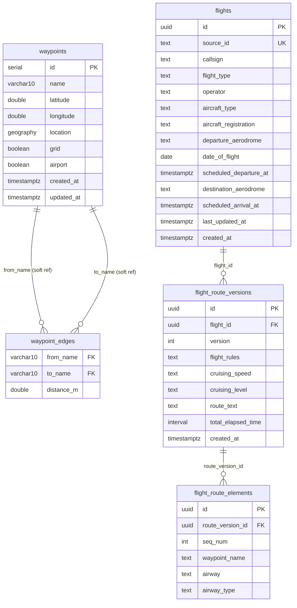

# Skyrouter
Route Planning for anything that flies

## Requirements

- [Docker](https://docs.docker.com/get-docker/) with the Compose plugin

No local Go installation is required — all build and test commands run inside Docker.

## First-time setup

```bash
cp .env.example .env   # copy the template and fill in your values
make tidy              # generate go.sum (runs go mod tidy inside Docker)
make run               # start postgres + app with hot reload
make migrate           # apply database migrations
```

The server will be available at `http://localhost:8080`.

## Environment variables

| Variable | Required | Default | Description |
|---|---|---|---|
| `DB_HOST` | yes | — | Postgres hostname |
| `DB_PORT` | no | `5432` | Postgres port |
| `DB_USER` | yes | — | Postgres user |
| `DB_PASSWORD` | yes | — | Postgres password |
| `DB_NAME` | yes | — | Postgres database name |
| `DB_SSLMODE` | no | `require` | `disable` for local dev |
| `PORT` | no | `8080` | HTTP server port |
| `FLIGHTS_ENDPOINT` | yes (job) | — | External FIXM flight data API URL |
| `FLIGHTS_API_KEY` | yes (job) | — | API key for flights endpoint |
| `WAYPOINTS_ENDPOINT` | yes (job) | — | External navaid/waypoint data API URL |
| `WAYPOINTS_API_KEY` | yes (job) | — | API key for waypoints endpoint |
| `AIRPORTS_ENDPOINT` | yes (job) | — | External airport data API URL |

## Makefile targets

| Command | Description |
|---|---|
| `make run` | Start postgres + app with air hot reload |
| `make down` | Stop all services and remove volumes |
| `make build` | Compile `./bin/server` inside Docker (dev binary) |
| `make test` | Run test suite against postgres inside Docker |
| `make migrate` | Apply all pending database migrations |
| `make teardown` | Roll back all database migrations |
| `make generate` | Delete generated files, regenerate Bob ORM models, then regenerate Mockery mocks |
| `make tidy` | Run `go mod tidy` inside Docker (updates `go.sum`) |
| `make logs` | Tail logs for all running services |
| `make clean` | Remove containers, volumes, images, and `./bin/` |

### Environment flag

Pass `ENV=<environment>` to target a different deployment template:

```bash
make build ENV=prod    # build production Docker image tagged skyrouter:latest
make test  ENV=ci      # CI test suite (no exposed ports, CI-friendly defaults)
```

Compose templates live in [deploy/](deploy/). `ENV=prod` uses `docker build` directly — no compose file.

## Project structure

```
cmd/
  server/              HTTP server entry point
  job/                 Batch job entry point (fetch-waypoints, fetch-flights, rebuild-edges)
internal/
  config/              Environment-based configuration
  db/                  Database connection pool
  handler/             HTTP handlers — parse request, call service, write response
  service/             Business logic + repository interfaces + domain types
  repo/                Concrete database implementations (Bob ORM + raw SQL)
  graph/               In-memory waypoint graph for Yen's k-shortest paths
  job/                 Job runners (fetch-waypoints, fetch-flights, rebuild-edges)
models/                Bob-generated ORM models (gitignored — regenerate with make generate)
deploy/                Docker Compose templates (local / ci)
migrations/            SQL migration files (golang-migrate)
```

## Architecture

### Layered design

The codebase follows a strict three-layer dependency chain:

```
handler  →  service  →  repo
```

- **Handler** — translates HTTP into service calls and back. Knows nothing about SQL.
- **Service** — owns the repository interface and domain types. Contains business logic. Depends on no concrete database types.
- **Repo** — implements the repository interface against Postgres. Translates Bob ORM rows into domain types.

Dependencies only flow downward. The repo package imports nothing from the service; they are connected only at the wiring point in `cmd/server/main.go`.

### Dependency inversion

The `FlightRepository` and `WaypointRepository` interfaces are declared in the **service** package (`internal/service/*/spec.go`), not in the repo package. The concrete repo satisfies the interface from the outside. This means:

- Service tests can swap in a mock repo with no database
- The repo can be replaced (e.g. swap Postgres for another store) without touching any service code
- Mocks are generated by Mockery and live under `internal/service/*/mocks/`

### Domain types

`spec.go` in each service package defines:
- **Read models** — `Flight`, `Waypoint`, `RouteElement` (plain structs, no ORM types)
- **Input/filter objects** — `UpsertWaypointInput`, `ListFlightsFilter`
- **Repository interface** — the port the service depends on
- **Sentinel errors** — e.g. `ErrNotFound` (domain language, not `sql.ErrNoRows`)

Domain types contain no database tags or HTTP tags. They are translated at each boundary:
- Repo maps Bob ORM rows → domain types (`toWaypoint`, `toFlight`)
- Handler maps domain types → JSON response

### CQRS split

The HTTP server (read path) and batch jobs (write path) are separate binaries with different responsibilities:

- `cmd/server` — serves `GET /flights`, `GET /flights/{id}`, `GET /flights/{id}/alternatives`, `GET /waypoints`
- `cmd/job` — ingests data from external APIs, upserts into Postgres, rebuilds the waypoint graph

Jobs call the repo layer directly, bypassing the service, since bulk ingestion has no user-facing business rules.

### Graph as a read model

`internal/graph/` maintains an in-memory adjacency list loaded from the `waypoint_edges` table. Key points:

- Edges are pre-computed by `RebuildEdges` using PostGIS `ST_Distance` (500 km radius, 3 nearest non-grid neighbours per waypoint)
- The graph is cached and rebuilt on a schedule — never recomputed per request
- Yen's k-shortest-paths algorithm runs against this graph to produce alternative routes

## Database schema

### Entity diagram



### Table notes

**`waypoints`**
- `name` is not unique — the same ICAO identifier (e.g. `BCN`) can exist at multiple coordinates worldwide. The unique constraint is `(name, ROUND(lat, 4), ROUND(lon, 4))`, one row per distinct physical location.
- `location` is a PostGIS `GEOGRAPHY` column kept in sync with `latitude`/`longitude` to enable fast spatial queries without recomputing from floats.
- `grid = true` marks named grid intersections (e.g. `57N020W`). These are excluded from edge building and the route graph — too numerous and not used in filed routes.
- `airport = true` flags ICAO airport entries so departure/destination coordinates can be resolved without a separate airports table.

**`waypoint_edges`**
- A pre-materialised adjacency list for the route graph. Computing `ST_Distance` on every alternative route request would be too slow, so edges are built once by the job and stored here.
- FK constraints to `waypoints(name)` were removed when `name` became non-unique. Integrity is maintained by the job's `DISTINCT ON (name)` logic when rebuilding edges.
- Each non-grid waypoint connects to at most 3 nearest neighbours within 500 km, keeping the graph sparse enough for Yen's algorithm to run quickly.

**`flights`**
- `source_id` (unique) is the external system's identifier, used as the upsert conflict key. The internal `id` (UUID) is never shared externally.
- `last_updated_at` drives a skip-if-unchanged upsert: if the source hasn't changed the flight, no new route version is written.
- `departure_aerodrome` and `destination_aerodrome` are plain text with no FK to `waypoints`. Airport coordinates are resolved at query time, keeping ingestion independent of whether the airport record has been loaded yet.

**`flight_route_versions`**
- Each route change produces a new version row rather than overwriting the previous one, preserving full amendment history.
- The API always reads the latest version (`ORDER BY version DESC LIMIT 1`). Older versions are archived but not exposed.

**`flight_route_elements`**
- Waypoints are stored as names only (`waypoint_name TEXT`) with no FK to `waypoints`. A route can reference a waypoint that hasn't been ingested yet.
- Coordinates are resolved at read time by bulk-fetching the relevant waypoints and running a greedy forward/backward disambiguation pass to select the geographically correct candidate when a name has duplicates.

## Deployment

### Infrastructure overview

| Component | Technology | Details |
|---|---|---|
| Cloud | AWS | Region `ap-southeast-1` |
| Container orchestration | EKS | Cluster `skyrouter-prod-cluster` |
| Container registry | ECR | Three images per release (see below) |
| Database | RDS Postgres | PostGIS enabled, SSL required |
| Backend ingress | AWS ALB | `api.skyquik.com` (HTTPS 443) |
| Frontend ingress | AWS ALB | `skyquik.com` (HTTPS 443) |
| Pod identity | IRSA | IAM role bound to `backend-sa` service account |
| Secrets | k8s Secret | `skyrouter-secrets` — injected via `envFrom.secretRef` |
| Helm charts | `skyrouter-infra` repo | `helm/backend`, `helm/frontend` |

---

### How a code push becomes a production deployment

```
push to main
     │
     ▼
┌─────────────────────────────────┐
│  CI  (skyrouter repo)           │
│  .github/workflows/ci.yml       │
│                                 │
│  1. make test ENV=ci            │
│  2. docker build × 3 images     │
│     - skyrouter-prod-backend    │
│     - skyrouter-prod-backend-   │
│       migrate                   │
│     - skyrouter-prod-job        │
│  3. docker push → ECR           │
│  4. repository_dispatch ────────────────────────────────┐
│     event-type: deploy-app      │                       │
│     payload: { service,         │                       │
│       image_tag: <git sha> }    │                       │
└─────────────────────────────────┘                       │
                                                          ▼
                                   ┌──────────────────────────────────┐
                                   │  Deploy  (skyrouter-infra repo)  │
                                   │  .github/workflows/deploy.yaml   │
                                   │                                  │
                                   │  1. OIDC → AWS credentials       │
                                   │  2. aws eks update-kubeconfig    │
                                   │  3. helm upgrade --install       │
                                   │     ├─ pre-upgrade hook runs     │
                                   │     │  migration Job (runs       │
                                   │     │  golang-migrate up)        │
                                   │     └─ new pods roll out         │
                                   │  4. kubectl rollout status       │
                                   └──────────────────────────────────┘
```

**Three ECR images are built per release:**
- `skyrouter-prod-backend:<sha>` — the HTTP server (`cmd/server`)
- `skyrouter-prod-backend-migrate:<sha>` — golang-migrate runner; runs as a Helm pre-upgrade Job before new pods start
- `skyrouter-prod-job:<sha>` — batch job binary (`cmd/job`); used by CronJobs in the cluster

The migration Job is a **Helm pre-install/pre-upgrade hook** (`hook-weight: -5`). It always completes before new pods are scheduled. If the migration fails, the Helm upgrade is aborted and existing pods keep running.

---

### Kubernetes workloads

| Workload | Kind | Schedule / Replicas | Purpose |
|---|---|---|---|
| `backend-backend` | Deployment | 1–4 replicas (HPA 70% CPU) | HTTP API server |
| `frontend-frontend` | Deployment | 1–3 replicas (HPA) | SSR frontend |
| `fetch-flights` | CronJob | `0 * * * *` (hourly) | Ingests flight data from external API |
| `fetch-waypoints` | CronJob | `0 1 1 * *` (monthly) | Ingests navaids and airports |
| `rebuild-edges` | CronJob | `0 2 1 * *` (monthly, after fetch-waypoints) | Rebuilds the waypoint adjacency graph |

Pod disruption budgets (`minAvailable: 1`) prevent all replicas being taken down simultaneously during node drain. Pods prefer to be spread across nodes via `podAntiAffinity`.

---

### Manual operations

**Trigger a deploy without a code push** (e.g. rollback to a specific tag):
```bash
gh workflow run deploy.yaml --repo Traezar/skyrouter-infra \
  -f service=backend -f image_tag=<git-sha>
```

**Run a batch job on demand:**
```bash
gh workflow run run-job.yml --repo Traezar/skyrouter \
  -f job_name=fetch-waypoints   # or fetch-flights
```

**Check what is running in the cluster:**
```bash
kubectl get deployment,cronjob,job -n default
kubectl logs -f deployment/backend-backend -n default
```

---

### Secrets management

All sensitive values live in a single Kubernetes Secret named `skyrouter-secrets`. Pods consume it via `envFrom.secretRef` — no secrets are baked into images or build args.

To add or update a secret value:
```bash
# Add a new key
kubectl patch secret skyrouter-secrets -n default \
  --type='json' \
  -p='[{"op":"add","path":"/data/MY_KEY","value":"'$(echo -n "my-value" | base64)'"}]'

# Replace an existing key
kubectl patch secret skyrouter-secrets -n default \
  --type='json' \
  -p='[{"op":"replace","path":"/data/MY_KEY","value":"'$(echo -n "my-value" | base64)'"}]'
```

Secret changes take effect on the next pod restart:
```bash
kubectl rollout restart deployment/backend-backend -n default
```

---

## Component diagram

```
External APIs                  cmd/server                              cmd/job
─────────────────     ─────────────────────────────────     ──────────────────────────────
WAYPOINTS_ENDPOINT ─┐  ┌─ FlightHandler                      ┌─ fetchwaypoints
AIRPORTS_ENDPOINT ──┼──┤    GET /flights                      │    GET WAYPOINTS_ENDPOINT
FLIGHTS_ENDPOINT  ─┐│  │    GET /flights/:id          ┌───────┤    GET AIRPORTS_ENDPOINT
                   ││  │    GET /flights/:id/alt       │       │    BulkUpsert → RebuildEdges
                   ││  │         │                     │       │
                   ││  │         ▼                     │       ├─ fetchflights
                   ││  │    FlightService               │       │    GET FLIGHTS_ENDPOINT
                   ││  │    ListFlights(filter)         │       │    parse FIXM JSON
                   ││  │    GetFlight(id)               │       │    UpsertFlights
                   ││  │         │                     │       │
                   ││  │         │ «interface»          │       └─ rebuildedges
                   ││  │         ▼                     │            RebuildEdges only
                   ││  │    FlightRepository            │
                   ││  │         │                     │  Repos (injected at startup)
                   ││  │         ▼                     │  ──────────────────────────
                   ││  │    FlightRepo ─────────────────┼──────────────────────────────┐
                   ││  │    LATERAL join + wpMap        │                              │
                   ││  │    closestTo() disambig        │                              │
                   ││  │                                │                              │
                   ││  ├─ WaypointHandler               │                              │
                   ││  │    GET /waypoints              │                              │
                   ││  │    GET /waypoints/:id          │                              │
                   ││  │         │                     │                              │
                   ││  │         ▼                     │                              │
                   ││  │    WaypointService             │                              │
                   ││  │    GetWaypoint(id)             │                              │
                   ││  │    ErrNotFound translation     │                              │
                   ││  │         │                     │                              │
                   ││  │         │ «interface»          │                              │
                   ││  │         ▼                     │                              │
                   ││  │    WaypointRepository          ├──────────────────────────────┤
                   ││  │         │                     │                              │
                   ││  │         ▼                     ▼                              ▼
                   ││  │    WaypointRepo ──────────► WaypointRepo              WaypointRepo
                   ││  │    BulkUpsert               (shared)                  (shared)
                   ││  │    RebuildEdges
                   ││  │
                   ││  └─ graph.Cache (24h TTL)
                   ││       │
                   ││       ▼
                   ││  graph.Load
                   ││       │
                   └┼───────┼──────────────────────────────────────────────────────────────┐
                    └───────┼──────────────────────────────────────────────────────────┐   │
                            │                                                          │   │
                            ▼                                                          │   │
                   ┌─────────────────────────────────────────────────────────────┐     │   │
                   │                   Postgres + PostGIS                        │     │   │
                   │                                                             │     │   │
                   │  waypoints              waypoint_edges      flights         │ ◄───┘   │
                   │  ─────────────────      ──────────────      ───────────     │         │
                   │  id (serial PK)         from_name (FK) ─┐  id (uuid PK)    │         │
                   │  name (varchar10)       to_name (FK)   ─┘  source_id (UK)  │         │
                   │  latitude               distance_m         callsign         │ ◄───────┘
                   │  longitude                                 departure        │
                   │  location (GEOGRAPHY)                      destination      │
                   │  grid (bool)                               last_updated_at  │
                   │  airport (bool)                                             │
                   │                         flight_route_versions               │
                   │                         ────────────────────                │
                   │                         id · flight_id (FK)                 │
                   │                         version (immutable)                 │
                   │                                                             │
                   │                         flight_route_elements               │
                   │                         ────────────────────                │
                   │                         route_version_id (FK)               │
                   │                         seq_num · waypoint_name             │
                   └─────────────────────────────────────────────────────────────┘
```

## Migrations

SQL migrations live in [migrations/](migrations/) and are managed with [golang-migrate](https://github.com/golang-migrate/migrate). Files follow the naming convention `{version}_{title}.up.sql` / `{version}_{title}.down.sql`.

```bash
make migrate    # apply all pending migrations
make teardown   # roll back all migrations
```

## ORM models and mocks

`internal/models/` is gitignored. After applying your database migrations, regenerate models and mocks with:

```bash
make generate
```

This does three things in order:
1. Deletes all `*.bob.go` and `*.bob_test.go` files
2. Runs **Bob** (`bobgen`) against the live postgres schema and writes Go types into `internal/models/`
3. Runs **Mockery** (`go tool mockery`) to regenerate interface mocks under `internal/service/*/mocks/`
